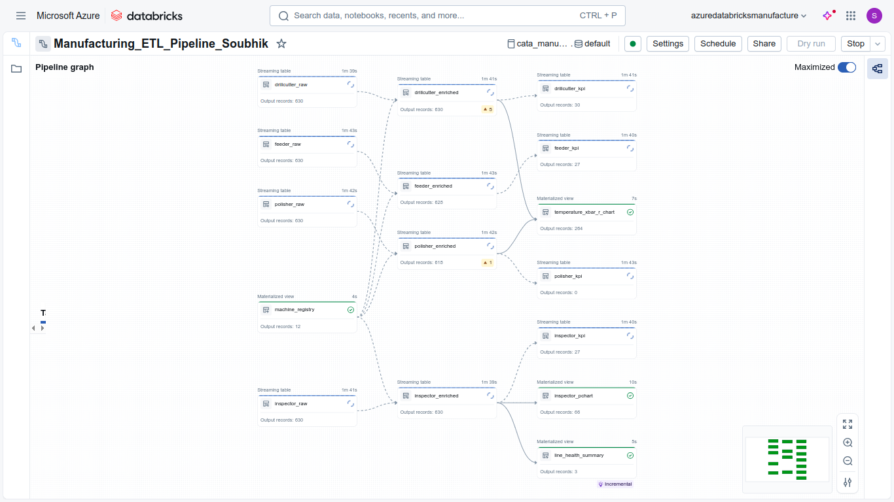
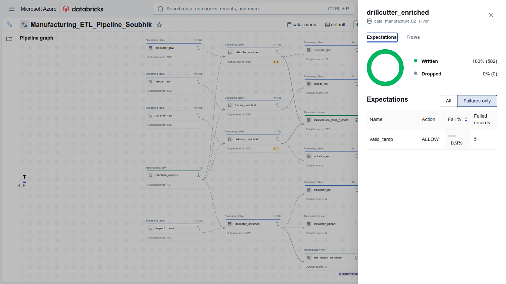
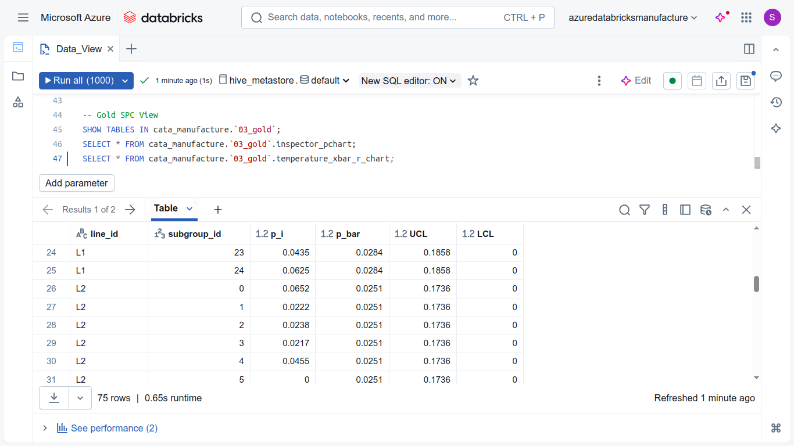
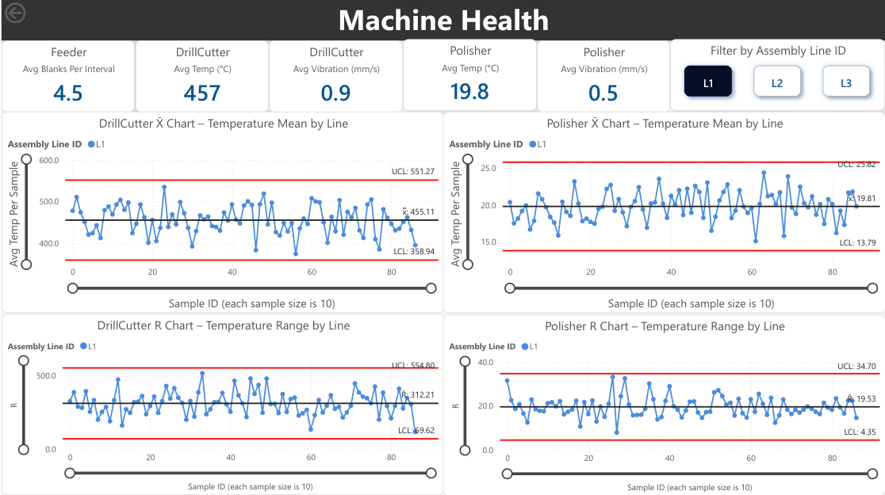

# Real-Time Manufacturing Process Analytics using Azure Databricks (DLT + Power BI)

This project demonstrates a **complete real-time data engineering and analytics pipeline** for a simulated **manufacturing process**, built end-to-end on **Azure Databricks**, **Delta Lake**, and **Power BI**. For data governance, Unity Catalog has been used. 
It ingests streaming IoT sensor data from virtual machines on the factory floor, processes it through **Bronze–Silver–Gold layers** using **Delta Live Tables (DLT)**, and visualizes live KPIs and SPC metrics (P-Chart, X̄-Chart, R̄-Chart) in Power BI.  



---

## Project Overview

### Factory Setup (Simulated)
- **3 Assembly Lines**, each with **4 machines**:
  - **Feeder** → feeds raw material
  - **DrillCutter** → temperature & vibration sensors
  - **Polisher** → temperature & vibration sensors
  - **Inspector** → counts good vs defective products  
- Each machine is connected to a **PLC (Programmable Logic Controller)** that sends telemetry to Azure.

---

## Architecture
**Data Flow:**

```text
IoT Data Generator (Python)
        ↓
Landing Zone (ADLS Gen2)
        ↓
Bronze Layer (Raw Delta Streams)
        ↓
Silver Layer (Cleaned + Enriched)
        ↓
Gold Layer (Aggregated KPIs + SPC Metrics)
        ↓
Power BI Dashboard (Real-time Monitoring)
```
**Tech Stack:**
- **Azure Databricks** – Real-time data processing with Delta Live Tables (DLT)  
- **Azure Data Lake Storage (ADLS Gen2)** – Landing, Bronze, Silver, and Gold zones
- **Unity Catalog** – Centralized governance for access control, lineage, and schema management   
- **Delta Lake** – Streaming ingestion, schema evolution, and time travel  
- **Python (PySpark)** – Data generation and transformation logic  
- **Power BI** – Interactive dashboard with SPC and machine-level analytics

## Pipeline Design

| Layer | Purpose | Tables |
|--------|----------|----------------|
| **00_Landing** | Raw IoT data arriving from PLCs | `feeder/`, `drillcutter/`, `polisher/`, `inspector/` |
| **01_Bronze** | Streaming ingestion into Delta tables | `feeder_raw`, `drillcutter_raw`, etc |
| **02_Silver** | Data cleaning, type casting, joining with static registry | `drillcutter_enriched`, `inspector_enriched`, etc |
| **03_Gold** | Aggregated KPIs & SPC chart preparation | `drillcutter_kpi`, `inspector_pchart`, `temperature_xbar_r_chart`, etc |

### Streaming and Watermarking
- Watermark: 2 minutes (to allow for late IoT events)
- Time window: 1 minute rolling windows in KPI aggregations
- Simulated latency: random network delay of up to 30 seconds per PLC event
- Each record includes:
  - event_time → Actual time sensor reading was generated
  - ingest_time → Time it reached ADLS

**Pipeline showing warnings when data is rubbish:**  


**One of Gold Tables:**    


## Power BI Dashboard

  

The Power BI report is split into **two main pages**:

1. **Page 1 – Production Quality**
   - P-Chart (Defect rate by subgroup)
   - KPI cards showing total produced, defective, and defect rate per assembly line

| Chart         | Purpose                                 | Sample Size | Constants Used                |
| ------------- | --------------------------------------- | ----------- | ----------------------------- |
| **P-Chart**   | Tracks defect proportion per line       | n = 30      | UCL/LCL = p̄ ± 3√(p̄(1−p̄)/n) |
| **X̄̿-Chart** | Monitors temperature stability          | n = 10      | A₂ = 0.308                    |
| **R̄̿-Chart** | Tracks range (variation) of temperature | n = 10      | D₃ = 0.223, D₄ = 1.777        |


3. **Page 2 – Machine Health**
   - X̄-Chart and R̄-Chart for DrillCutter and Polisher temperature stability
   - Real-time vibration monitoring per line

**Slicers** allow filtering by Assembly Line ID or Machine Type.

## Author

**Soubhik Sen**  
**M.Tech — Operations Research (2026)**  
**E-Mail**: sensoubhik2001@gmail.com  
📍 Built using: Azure Databricks · Delta Lake · Power BI · Python

## Future Work
- Integrate with Azure IoT Hub / Event Hub for real device streaming
- Add alerting and anomaly detection using ML models
